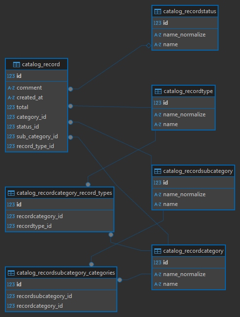

# Money Transfer
[](https://github.com/Vek123/test-it-solutions/actions/workflows/django.yml)
<br>
<br>
Это приложение создано для управления движенем денежных средств (ДДС).

## Требования
- `python == 3.11`

```bash
sudo apt-get update  # установка на Linux, на Windows через оф. сайт.
sudo apt install python3.11
sudo apt-get -y install python3-venv

python3 --version  # Linux
python --version  # Windows
```

- [`Git`](https://git-scm.com/downloads)
- [`gettext`](https://www.gnu.org/software/gettext/) - необходимо для локализации.

```bash
apt install gettext  # debian-based linux
```

## Подготовка к запуску

- Склонируйте репозиторий

```bash
git clone https://github.com/Vek123/test-it-solutions.git
cd test-it-solutions
```

- Настройте виртуальное окружение

```bash
python3 -m venv .venv

source .venv/bin/activate # WINDOWS - .\.venv\Scripts\activate
```

## Developer mode

- Установите необходимые зависимости

```bash
pip3 install -r requirements/dev.txt
```

- Создайте файл `.env` с помощью шаблона `template.env`

```bash
cp template.env .env # WINDOWS - copy template.env .env
# Заполните файл .env
```

- Примените миграции

```bash
cd money_transfer
python3 manage.py migrate
```

- Загрузите фикстуры

```bash
python3 manage.py loaddata records.json
```

- Скомпилируйте файлы локализации

```bash
django-admin compilemessages
```

- Создайте суперпользователя для админ-панели

```bash
python manage.py createsuperuser
```

- Запустите приложение

```bash
python manage.py runserver
```

## Production mode

- Установите необходимые зависимости

```bash
pip3 install -r requirements/prod.txt
```

- Создайте файл `.env` с помощью шаблона `template.env`

```bash
cp template.env .env # WINDOWS - copy template.env .env
# Заполните файл .env
```

- Примените миграции

```bash
cd money_transfer
python3 manage.py migrate
```

- Скомпилируйте файлы локализации

```bash
django-admin compilemessages
```

- Создайте суперпользователя для админ-панели

```bash
python manage.py createsuperuser
```

- Запустите приложение

```bash
python manage.py runserver
```

## Запуск тестов

- Установите необходимые зависимости

```bash
pip3 install -r requirements/test.txt
```

- Создайте файл `.env` с помощью шаблона `template.env`

```bash
cp template.env .env # WINDOWS - copy template.env .env
# Заполните файл .env
```

- Запустите синтаксические тесты

```bash
flake8 --verbose
black --verbose .
```

- Запустите тесты приложения

```bash
cd money_transfer
python3 manage.py test
```

## ER-Диаграмма


